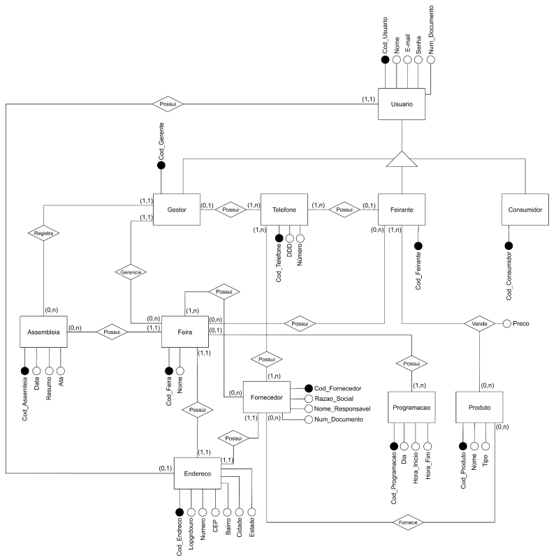

# 🎯 Projeto Integrado II - Feira Conectada

**Universidade Federal do Cariri (UFCA)**  
**Análise e Desenvolvimento de Sistemas (ADS)**  
**Disciplina**: PROJETO INTEGRADO II [ADS0013]  
**Professor**: Prof. Allysson Allex Araújo  

---

## 👥 Equipe

| Nome | Matrícula |
|------|-----------|
| Jefferson Rodrigues de Oliveira | 2025013432 |
| Lucas Gabriel Correia Gonçalves | 2025013479 |
| Luiz Filipy Soares da Silva | 2025013503 |
| Marcelo dos Santos Alves | 2023010825 |
| Weber Fernandes da Silva | 2025019356 |

---

## 💾 Estrutura do Banco de Dados

### Tecnologia
- **SGBD**: PostgreSQL

### Scripts de Criação

#### 📝 Script 1: CreateDatabase
Cria o banco de dados `sistema_feira`

#### 📝 Script 2: CreateTables
Cria todas as tabelas do banco de dados com as seguintes estruturas:

- **Endereco** - Entidade independente
- **Usuario** - Superclasse
  - Subclasses: Gestor, Feirante, Cliente
- **Fornecedor** - Relacionamento 1:1 com Endereco
- **Feira** - Gerenciada por 1 Gestor, possui 1 Endereço (1:1)
- **Assembleia** - Eventos da feira
- **Programacao** - Agendar atividades/ativações
- **Produto** - Itens comercializados
- **Telefone** - Contato (pode pertencer a Gestor, Feirante ou Fornecedor)

#### Relacionamentos
- **N:M**: Feira ↔ Feirante
- **N:M**: Feirante —Vende→ Produto
- **N:M**: Fornecedor —Fornece→ Produto

### 📊 Diagrama Entidade-Relacionamento (DER)

*Diagrama Entidade-Relacionamento elaborado para subsidiar a construção do projeto físico do banco de dados*

---

## 📚 Componente Extensionista: O Projeto Físico

### O que é?
O Projeto Físico de Banco de Dados é a fase de implementação técnica. É o momento em que pegamos a lógica de negócio definida nos diagramas e escrevemos os comandos SQL (DDL) específicos para o Sistema Gerenciador de Banco de Dados escolhido (neste caso, o **PostgreSQL**). Aqui, definimos tipos de dados (como VARCHAR ou SERIAL), criamos restrições (CONSTRAINTS) e configuramos a segurança dos dados.

### Por que é importante?
Um projeto físico bem feito facilita imensamente a escrita do código. Se o banco garante que um e-mail é único ou que um endereço não pode ficar "órfão", o programador precisa escrever menos código de validação no Back-end. Entender isso nos ajuda a criar aplicações mais eficientes, rápidas e com menos bugs.

---

## 📦 Componentes do Projeto

- `CreateDatabase.sql` - Script de criação do banco de dados
- `CreateTables.sql` - Script de criação das tabelas
- `README.md` - Este arquivo com documentação do projeto
- `img/der.jpg` - Diagrama Entidade-Relacionamento do projeto físico